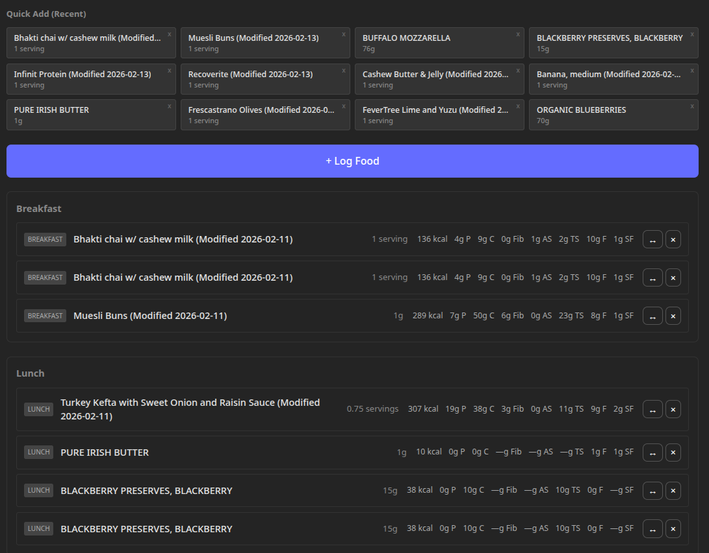
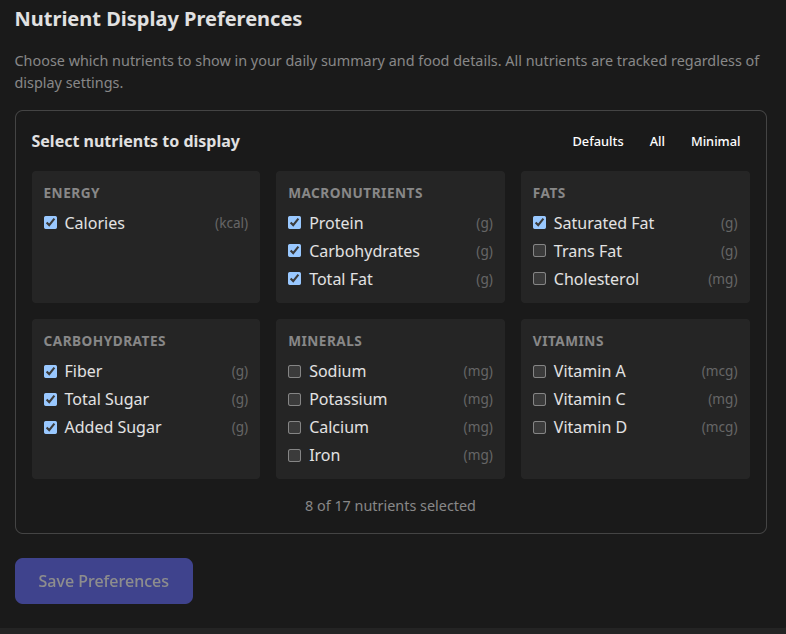
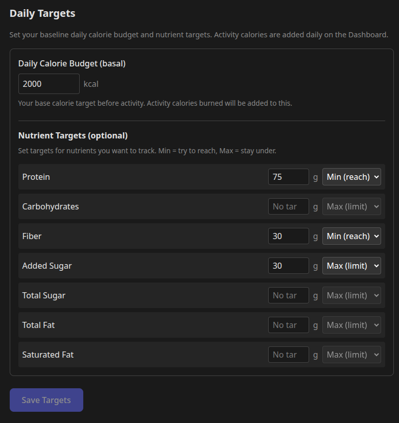
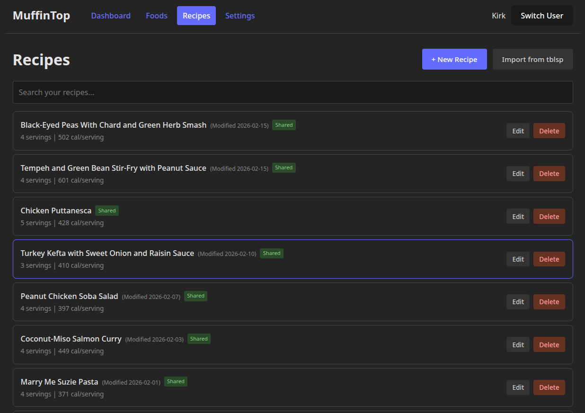
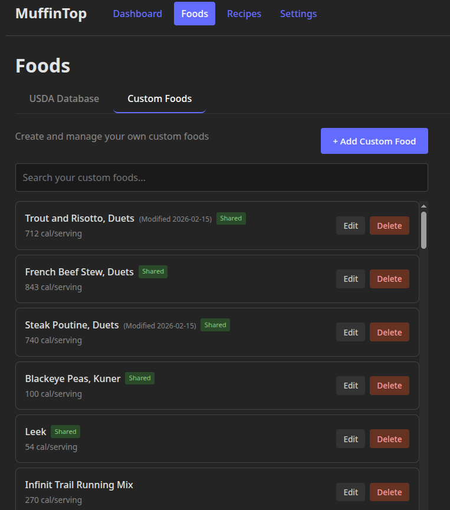
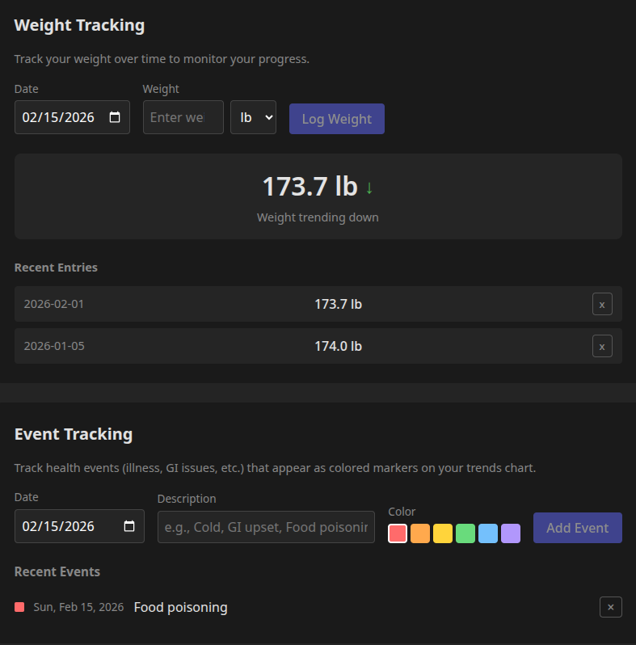
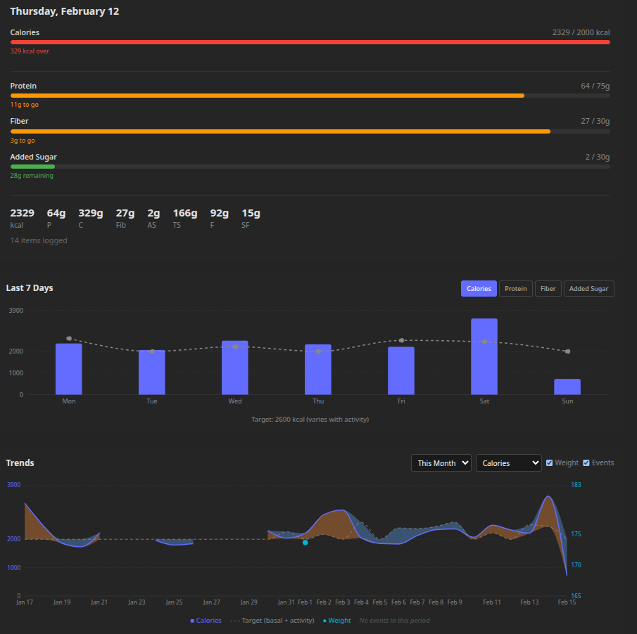

# MuffinTop

A self-hosted calorie and nutrition tracker with multi-user support, recipe management, and longitudinal trend analysis.

## Features

- **Food Logging** - Search 2M+ foods from USDA FoodData Central, log meals with customizable portions
- **Nutrient Tracking** - Track 17 nutrients including calories, protein, carbs, fats, fiber, vitamins, and minerals
- **Custom Foods** - Create your own foods with per-serving nutrients (matches nutrition labels)
- **Recipes** - Build recipes from ingredients, automatically calculate nutrition per serving
- **Daily Targets** - Set calorie and nutrient goals with min/max directions, track progress with visual indicators
- **Weight Tracking** - Log body weight in kg or lbs, view trends over time
- **Activity Logging** - Record exercise calories to adjust daily calorie budget
- **Event Logging** - Mark significant events (diet changes, illness, travel) that appear on trend charts
- **Trend Charts** - Visualize nutrition and weight trends with target comparison and colorblind-friendly indicators
- **Multi-User** - Support multiple users with isolated data
- **Recipe Import** - Import recipes from [tblsp](https://github.com/KirkDCO/tblsp) recipe manager

## Tech Stack

- **Backend**: Node.js 20+, Express.js, SQLite (better-sqlite3)
- **Frontend**: React 18, TypeScript, Vite, TanStack Query
- **Data**: USDA FoodData Central (~2M foods with serving sizes)

## Quick Start

```bash
# Clone and install
git clone https://github.com/KirkDCO/muffintop.git
cd muffintop
npm install

# Initialize database
npm run db:init

# Start development servers
npm run dev
```

Open http://localhost:5173 in your browser.

## USDA Food Database

The app includes 24 sample foods for testing. For the full USDA database (~2M foods):

```bash
# Download and import (takes 10-20 minutes)
npm run usda:import

# Or import only foundation foods (~10k whole foods, faster)
npm run usda:import -- --foundation-only
```

The import includes:
- **Foundation foods** (~400) - Basic whole foods with detailed nutrients
- **SR Legacy foods** (~8k) - Standard reference foods with portions (cups, tbsp, etc.)
- **Branded foods** (~2M) - Commercial products with serving sizes

## Project Structure

```
muffintop/
├── backend/           # Express API server
│   ├── src/
│   │   ├── api/       # REST endpoints
│   │   ├── services/  # Business logic
│   │   ├── models/    # Zod validation schemas
│   │   └── db/        # Database connections
│   └── db/
│       └── schema.sql # Complete database schema
├── frontend/          # React SPA
│   ├── src/
│   │   ├── components/
│   │   ├── pages/
│   │   ├── hooks/
│   │   └── providers/
│   └── tests/e2e/     # Playwright tests
├── shared/            # Shared TypeScript types
│   └── types/
└── scripts/           # Utility scripts
```

## Available Scripts

```bash
# Development
npm run dev              # Start both frontend and backend
npm run dev -w backend   # Start backend only
npm run dev -w frontend  # Start frontend only

# Building
npm run build            # Build all packages
npm run build:prod       # Production build

# Database
npm run db:init          # Initialize database schema
npm run db:reset         # Reset database (clears all data)

# Testing
npm test                 # Run all tests
npm run test -w frontend # Run frontend tests
npx playwright test      # Run E2E tests (from frontend dir)

# USDA Import
npm run usda:import      # Download and import USDA data
```

## Configuration

Environment variables (create `.env` in project root):

| Variable | Default | Description |
|----------|---------|-------------|
| `PORT` | `3002` | Backend server port |
| `NODE_ENV` | `development` | Environment mode |
| `CORS_ORIGIN` | `http://localhost:5173` | Allowed CORS origin |
| `USDA_DATABASE_PATH` | `backend/db/usda/fooddata.db` | USDA database location |
| `TBLSP_DB_PATH` | (none) | tblsp database for recipe import |

## API Overview

All endpoints are prefixed with `/api/v1`.

| Endpoint | Description |
|----------|-------------|
| `GET /users` | List all users |
| `POST /users` | Create user |
| `GET /foods/search?q=` | Search foods |
| `GET /foods/:fdcId` | Get food details |
| `GET /users/:id/food-log?date=` | Get daily food log |
| `POST /users/:id/food-log` | Log food entry |
| `GET /users/:id/recipes` | List recipes |
| `POST /users/:id/recipes` | Create recipe |
| `GET /users/:id/custom-foods` | List custom foods |
| `POST /users/:id/custom-foods` | Create custom food |
| `GET /users/:id/targets` | Get daily targets |
| `PUT /users/:id/targets` | Update targets |
| `GET /users/:id/activity` | Get activity log |
| `POST /users/:id/activity` | Log activity calories |
| `GET /users/:id/metrics/weight` | Get weight history |
| `POST /users/:id/metrics/weight` | Log weight |
| `GET /users/:id/events` | Get user events |
| `POST /users/:id/events` | Create event |
| `GET /users/:id/stats/daily` | Daily nutrition stats |
| `GET /users/:id/stats/trends` | Longitudinal trends |

## Roadmap

See [ROADMAP.md](ROADMAP.md) for potential future features including copy meals, favorites, water tracking, barcode scanning, and more.

## Production Deployment

See [DEPLOYMENT.md](DEPLOYMENT.md) for detailed deployment instructions including:
- Single-server deployment
- Systemd service configuration
- Docker containerization
- Nginx reverse proxy setup

Quick production start:

```bash
npm run build:prod
npm run db:init
npm run usda:import
NODE_ENV=production npm run start:prod
```

## Screenshots

### Food Logging
Search foods, select portions, and log meals throughout the day.



### Nutrient Tracking
Track 17 nutrients with progress indicators showing daily intake vs targets.



### Daily Targets
Set calorie and nutrient goals with min/max directions for each nutrient.



### Recipes
Create recipes from ingredients with automatic nutrition calculation per serving.



### Custom Foods
Add your own foods with per-serving nutrition data.



### Weight & Event Tracking
Log body weight and significant events that appear on trend charts.



### Trend Charts
Visualize nutrition and weight trends over customizable time periods with target comparison.



## Development

### Adding a New Nutrient

1. Add to `shared/types/nutrients.ts` NUTRIENT_REGISTRY
2. Add column to `backend/db/schema.sql` (all relevant tables)
3. Update USDA import script if needed
4. Reset database: `npm run db:reset && npm run usda:import`

### Running E2E Tests

```bash
cd frontend
npx playwright test
npx playwright test --ui  # Interactive mode
```

## License

MIT

## Acknowledgments

- Food data from [USDA FoodData Central](https://fdc.nal.usda.gov/)
- Built with [Claude Code](https://claude.ai/code)
